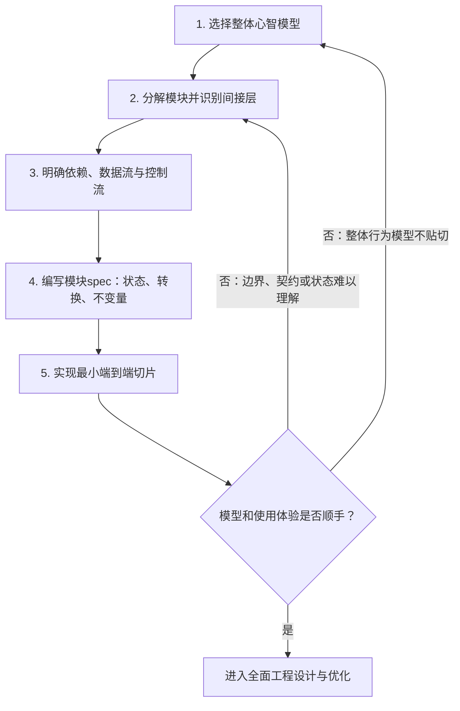

## 设计系统的五步循环：从心智模型到可用原型

系统设计先要选对描述问题的方式，再决定模块边界和依赖关系。下面五步用于形成并检验系统的第一版结构；当模型和交互方式已经顺手，再进入性能、资源调度等全面工程设计。

### 1. 选择合适的整体心智模型

先判断系统的规模、主要行为和最难理解的部分，再选择能让整体关系最清楚的模型。**心智模型是压缩复杂度的坐标系**：例如，用 map 描述当前状态；用“初始状态 + 更新日志”描述状态如何演化；用消息流描述异步组件之间的交互。网络系统通常要显式表达超时和幂等性，并发系统则要表达共享状态的一致性约束。

模型应当帮助回答“系统由什么构成、如何变化、什么情况算正确”。如果必须不断跳进实现细节才能解释正常行为，可能是模型还没有抓住主要结构。

### 2. 分解模块，并决定何处需要间接层

把复杂问题分解为职责清楚、尽量正交的模块。依据共同变化的原因和责任边界划分：同一原因驱动变化的职责倾向放在一起，变化原因不同的职责倾向分开。正交的模块可以分别理解和修改，模块之间通过明确的契约协作。

**静态边界**通常由**接口**和数据类型表达。对于**运行时**需要替换实现、延迟选择目标、集中控制或转发的关系，可以加入**间接层**(name->indirect->value)，例如代理、provider、注册表或 channel。间接层要对应明确的变化点或控制需求；它本身也会增加查找和理解成本。

### 3. 画出依赖、数据流和控制流

先确定谁拥有决策权、谁依赖谁，再画出正常路径和非正常路径。至少标出：

- 数据从哪里产生、经过哪些模块、由谁消费；
- 谁发起操作、谁选择策略、谁负责完成；
- 失败后如何传播，操作如何取消，何时重试，以及如何恢复。

这些路径基本确定总体结构和依赖方向。接口契约应说明输入、输出、状态约束、错误语义和生命周期责任，避免模块只在“正常成功”的假设下才能配合。

### 4. 为模块写状态与转换spec

每个模块先说明它负责的**状态**，再说明哪些动作会让状态发生变化(**状态转换**)。状态可以描述某一时刻的事实（例如 map），也可以描述演化过程（例如初始状态和更新日志）。把动作写成状态转换关系：

```text
r(s, s')
```

意思是动作允许系统从状态 `s` 转到状态 `s'`。

再列出**所有可达状态都必须满足的不变量**，用它们界定正确行为。

spec应覆盖正常转换，以及错误、取消、重试和恢复时的状态变化。

### 5. 实现最小纵向切片，并用使用体验修正模型

实现一条可运行的端到端路径，让模块边界、接口和数据流接受真实使用的检验。观察调用是否自然、状态是否容易追踪、错误是否能定位、取消和恢复是否符合预期。若组件难以组合、调用方需要知道过多内部细节，或spec无法解释实际行为，就回到前面的步骤调整模型、边界或契约。

当这条路径已经容易理解和使用，第一版结构才算站稳；随后再深入性能优化、资源管理、调度和容量等工程设计。原型反馈也不意味着架构永久定型，新的证据仍可触发迭代。



## 全面工程设计与优化需考虑的问题
                 ① WHY
                  │
             What problem?
                  │
                  ↓
             ② BOUNDARY
                  │
          Who owns what?
                  │
                  ↓
             ③ DATA FLOW
                  │
       Producer → Consumer
                  │
                  ↓
             ④ CONCURRENCY
                  │
          What can run together?
                  │
                  ↓
             ⑤ RESOURCES
                  │
      CPU / Memory / IO / Buffer
                  │
                  ↓
             ⑥ BACKPRESSURE
                  │
        What if demand > capacity?
                  │
                  ↓
             ⑦ SCHEDULING
                  │
           Who gets resource?
                  │
                  ↓
             ⑧ FAILURE
                  │
          What if something dies?
                  │
                  ↓
             ⑨ LIFECYCLE
                  │
          Start → Run → Stop
                  │
                  ↓
             ⑩ OBSERVABILITY
                  │
         How do I know it's broken?
                  │
                  ↓
             ⑪ OPTIMIZATION
                  │
       Make it faster / cheaper
                  │
                  ↓
             ⑫ VALIDATION
                  │
      Does the whole system improve?


## 成长路径
```
局部性能优化
      ↓
并发设计
      ↓
Resource Management
      ↓
Scheduling / Backpressure
      ↓
Failure / Lifecycle
      ↓
Observability
      ↓
System-level Optimization
```


## References

- [Hints and principles for computer system and design](https://www.youtube.com/watch?v=xrR0E7MImAE&t=2155s) — 核心设计灵感来源，提供选择心智模型、分解系统和使用间接层等思路。
- [Reth](https://github.com/paradigmxyz/reth) — 核心工程实现参考，用于观察这些设计思路如何落实为模块边界、接口、数据流和运行时机制。
