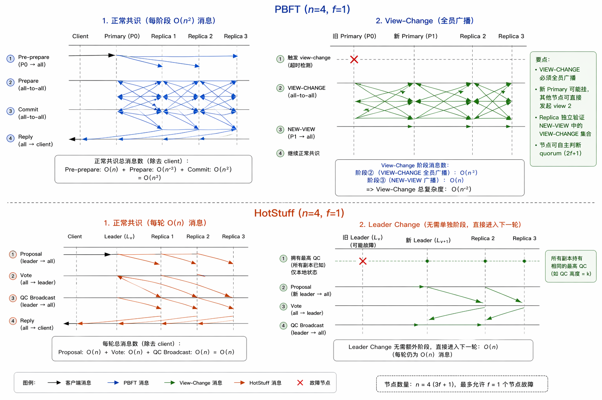

# The crux of consensus
The essence of BFT consensus is ensuring that a new leader extends a state consistent with previous leaders.
> By dahila malkhi in breakthrough in consensus research from chainlink labs.

## PBFT
每个节点根据其他节点的投票，自行维护当前状态。

新节点在view change时需要收集并重建分散的投票状态，因为他没有把多数同意转换成一个可传递的证明(QC).

- PBFT保存的状态:
```
我收到了：
  - 来自 A,B,C 的 prepare
  - 来自 B,C,D 的 commit
```

- HotStuff保存的状态:
```
QC = {
  block_id,
  view_number,
  signatures (≥2f+1)
}
```

PBFT 传递的是“信息”，HotStuff 传递的是“结论”

## HotStuff
- 每个节点验证来自leader的highest QC和合法性(根据规则接收); 新块要么在 highest QC 上延伸，要么其 view number 高于 locked QC 的 view
- 新节点在viewchange时，只用选一个 highest QC，然后在它上面出新块就行了

## PBFT vs HotStuff


- 需要注意的是虽然PBFT NEW-VIEW 不是“相信 leader”，而是“验证 leader”