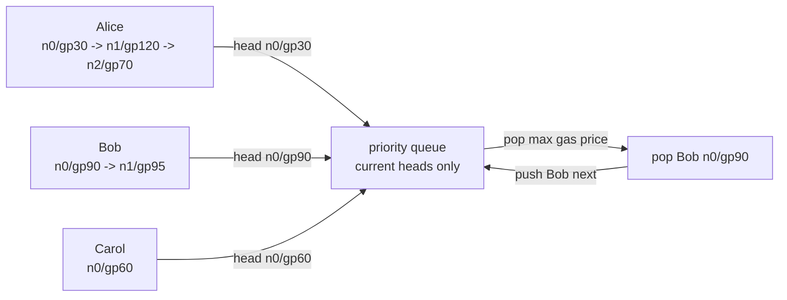

# Understanding Reth's Best Tx Iterator: A k-way Merge and MVCC Snapshot Perspective

## Terminology Explanation

| Terminology | Description |
|---|---|
| Best tx | The next transaction that the block builder should try to include, under nonce and fee constraints. |
| Head | The first currently executable transaction in a sender's nonce-ordered stream. |
| Priority queue | The candidate set that contains only currently executable heads, ordered by gas price. |
| Pop / push | `pop` removes the highest-priority head from the priority queue; `push` inserts the next transaction from the same sender stream. |
| Snapshot | A stable view of the pool captured when the iterator is created. The iterator can mutate this view locally. |
| MVCC-like snapshot | An analogy to database Multi-Version Concurrency Control(MVCC): readers use a stable version while writers continue to produce newer versions. |
| OrdMap | An immutable ordered map implemented as a B+tree. |

## Background

When reading Reth's mempool implementation, it is easy to get pulled into many engineering details: pending pool, queued pool, base fee checks, blob constraints, replacement rules, and invalid marking. Each of those pieces matters, but if the goal is to understand how the block builder repeatedly asks the pool for "the next best transaction," the main thread should be narrowed first. Instead of starting from the full txpool lifecycle, we can focus on what the `best_transactions` iterator is trying to answer.

This article focuses on two questions. 
- 1. **how should we model the best tx selection problem?** It is not a simple global fee ordering; it is closer to a k-way merge with nonce constraints. 
- 2. **how should the data behind the best tx iterator be organized?** The iterator needs to isolate its local selection state from the live mempool while avoiding a full deep copy and long-held locks. This is why the design is useful to understand through an MVCC-like snapshot lens.

---

## Where the naive model breaks

The most natural idea is to treat the mempool as a priority queue ordered by effective tip or gas price. Since the block builder wants to maximize revenue, we might think it can simply pop the transaction with the highest gas price each time. This model is tempting because it turns best tx selection into a standard priority queue problem. However, it misses one hard Ethereum constraint: transactions from the same sender must execute in nonce order.

Consider a tiny example. Each cell has two fields: `nonce`, which determines the execution order within one sender, and `gas price`, which determines priority across currently executable sender heads.

| sender | tx 0 | tx 1 | tx 2 |
|---|---|---|---|
| Alice | nonce=0, gas=30 | nonce=1, gas=120 | nonce=2, gas=70 |
| Bob | nonce=0, gas=90 | nonce=1, gas=95 | - |
| Carol | nonce=0, gas=60 | - | - |

If we only sort by gas price, `Alice(nonce=1, gas=120)` should be included first. But its nonce is 1, while `Alice(nonce=0, gas=30)` has not executed yet, so the high-gas transaction is not executable right now. This counterexample shows that global gas-price ordering selects the transaction that looks most profitable, not the transaction that is actually valid to try next.

Therefore, best tx selection should not start with "which transaction is globally highest?" It should start with "which transactions are currently eligible to compete?" For each sender, only the current nonce head is eligible. Later transactions, even with higher gas prices, cannot enter the candidate set until the earlier nonce has been popped.

---

### A minimal model for best tx

To make the structure visible, we can build a minimal model and temporarily ignore queued transactions, base fee subpools, blob constraints, replacement rules, and balance checks. We keep only two conditions:
1. **each sender's transactions are sorted by consecutive nonce.**
2. **each round can only choose the highest-gas transaction among currently executable heads.**

This model is essentially a k-way merge. Each sender is a nonce-ordered stream, and the priority queue contains only the current head of each stream. On every iteration, the iterator pops the head with the highest gas price from the priority queue. If that sender stream has a next nonce, the iterator pushes that next transaction back into the priority queue.



The diagram has one key idea: the priority queue does not contain all transactions. It only contains the currently executable head from each sender. Initially, the queue is `{Alice n0/gp30, Bob n0/gp90, Carol n0/gp60}`, so it pops `Bob n0/gp90`. Then it pushes `Bob n1/gp95`, making the next queue `{Alice n0/gp30, Bob n1/gp95, Carol n0/gp60}`. Although `Alice n1/gp120` has a higher gas price, it cannot enter the queue until `Alice n0/gp30` has been popped.

Running the process to completion gives this sequence:

| step | priority queue before pop | pop | push next |
|---|---|---|---|
| 1 | Alice n0/gp30, Bob n0/gp90, Carol n0/gp60 | Bob n0/gp90 | Bob n1/gp95 |
| 2 | Alice n0/gp30, Bob n1/gp95, Carol n0/gp60 | Bob n1/gp95 | - |
| 3 | Alice n0/gp30, Carol n0/gp60 | Carol n0/gp60 | - |
| 4 | Alice n0/gp30 | Alice n0/gp30 | Alice n1/gp120 |
| 5 | Alice n1/gp120 | Alice n1/gp120 | Alice n2/gp70 |
| 6 | Alice n2/gp70 | Alice n2/gp70 | - |

This sequence validates the model. The iterator is not outputting transactions by global gas price. Instead, it preserves nonce order, pops the best currently executable head, and pushes the next transaction from the same sender stream. This is the most useful entry point for understanding Reth's `BestTransactions` behavior.

In a minimal implementation, the core state can be compressed into two collections:

```rust
struct BestTxs {
    // All pending txs visible to this iterator, indexed by (sender, nonce).
    all: OrdMap<TxId, Tx>,

    // Currently executable heads, ordered by gas price.
    queue: BTreeSet<Tx>,
}
```

`queue` answers "which transaction can be selected now?" `all` answers "after this transaction is selected, where is the next nonce for the same sender?" With those two collections, the core `next()` logic is short:

```rust
fn next(&mut self) -> Option<Tx> {
    let best = self.queue.pop_last()?;
    self.all.remove(&best.txid());

    if let Some(next) = self.all.get(&best.unlocks()) {
        self.queue.insert(next.clone());
    }

    Some(best)
}
```

At this point, the intuition for best tx selection is clear: it is not a global sorting problem. It is a head-selection problem across multiple nonce streams. Real Reth adds invalid marking, fee filtering, blob skipping, and other constraints, but these are layered on top of the same skeleton. They can change whether a head is usable, but they do not change the main loop: `pop head -> push next head`. In transaction-pool terms, pushing the next head is the same as unlocking the next nonce from the same sender.

---

## The next bottleneck: iterator state

The model above explains how to choose transactions, but it does not yet explain where the iterator's data should come from. In a real node, the block builder does not consume the iterator instantly. It takes one transaction, executes it, checks gas and blob constraints, and may mark a transaction invalid if execution fails. Meanwhile, the live pool continues to receive RPC and P2P transactions, and it also reacts to canonical state updates from new blocks.

There are two straightforward approaches:

1. Let the iterator directly borrow the live pool and hold a lock during block building. This gives the iterator a consistent view, but it ties the block-building lifecycle to the mempool update path.
2. Deep-copy all pending transactions when the iterator is created. This gives the iterator its own view, but every best iterator construction copies the whole pool, which is expensive in memory bandwidth and allocation cost.

Both approaches have the same underlying issue: they fail to separate live pool state from iterator-local selection state. The best iterator needs to remove returned transactions from its own `all`, push next heads into its priority queue, and track invalid senders. These are temporary states internal to the selection process. They should not mutate the live pool, and they should not force the live pool to wait until block building finishes.

---

### Snapshot as a small MVCC

A better model is to treat the best iterator as an MVCC reader. When the iterator is created, it captures a stable version of the pending pool. After that, the iterator can mutate this version locally, while the live pool continues to advance its own newer versions. The read view and write view are separated, so the block builder can consume the iterator slowly while the mempool continues to process add, remove, and state-update events.

This is where a persistent ordered map such as `OrdMap` fits the model well. First, it satisfies the ordered-index requirement: the key is `(sender, nonce)`, so the iterator can look up `best.unlocks()` and scan by sender range. More importantly, `clone()` can create a low-cost snapshot through structural sharing rather than copying the entire map. Later mutations to the iterator's snapshot only copy the nodes along the modified path.

In the minimal implementation, `best()` can look like this:

```rust
pub fn best(&self) -> BestTxs {
    BestTxs {
        all: self.pending.clone(),
        queue: self.independent_txs.values().cloned().collect(),
    }
}
```

**The meaning of this code is not "copy every transaction." It is "create an independently consumable version."** Once `BestTxs` owns its `all`, `next()` can safely remove, push next, and mark invalid inside the iterator. The live pool can still accept new transactions or apply canonical state updates. In other words, the snapshot turns the iterator into a local state machine instead of a concurrent object that shares mutable state with the live pool.

Calling this MVCC does not mean the txpool implements database transactions. There is no transaction log and no SQL isolation level. The useful analogy is narrower: readers observe a stable version while writers move the system to newer versions. For the best iterator, that idea gives two direct benefits: less memory copying than a deep clone, and lower implementation complexity when the live pool changes while the iterator is being consumed.

---

## What this explains in Reth

The real Reth txpool is more complex than this minimal model. Besides pending transactions, there are queued, base-fee, blob, and other subpools. Transactions may be filtered or moved because of fees, blobs, execution failures, local policy, or pool limits. `BestTransactions` also lets the consumer mark transactions invalid so descendants from the same sender are not returned incorrectly. These details are important, but they extend the model rather than replace it.

So when reading the source code, I would keep two lines in mind. First, `best_transactions` is a k-way merge: each sender is a nonce stream, and the iterator selects only among current heads. Second, the iterator needs an MVCC-like snapshot: it independently maintains `all/queue/invalid` as local selection state while avoiding a full deep copy and long-held locks. Once these two lines are clear, Reth's subpools, fee filters, and lifecycle management become much easier to place.

## References

- [Reth transaction pool docs](https://reth.rs/docs/reth_transaction_pool/index.html)
- [Reth PendingPool docs](https://reth.rs/docs/reth_transaction_pool/pool/pending/struct.PendingPool.html)
- [imbl OrdMap docs](https://docs.rs/imbl/latest/imbl/ordmap/index.html)
- [Minimal mempool Rust implementation](https://github.com/pochenai/Rust_learn/blob/master/examples/tx-pool/src/pool.rs)
