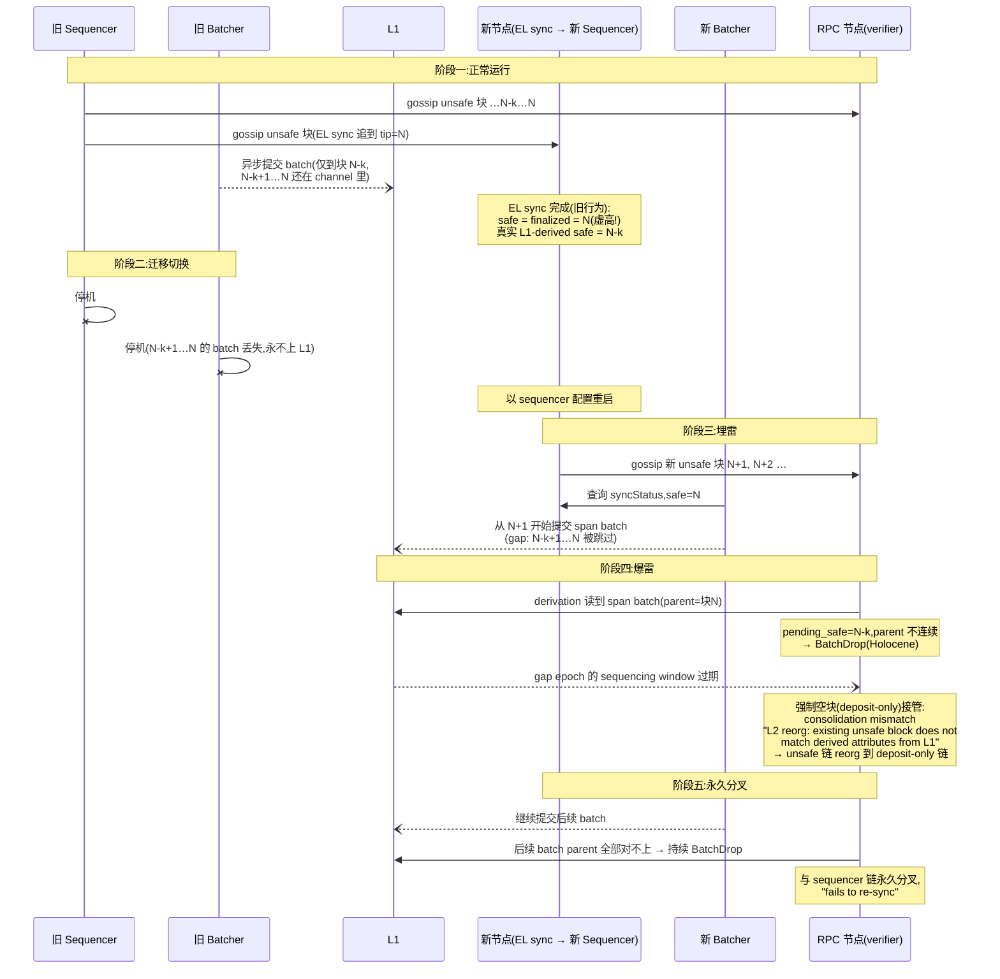

# op-node safe/finalized 标签与 EL sync 迁移事故分析

## 1. 三个安全标签的定义

权威定义在 `op-service/eth/sync_status.go`(`SyncStatus` 结构注释):

| 标签 | 定义 | 可逆性 |
|---|---|---|
| **unsafe** | L2 链绝对最新块,数据还没提交到 L1。sequencer 正在构建、或 verifier 通过 p2p gossip 收到的块 | 可被 L1 批次数据推翻 |
| **safe** | 从 L1 上的批次数据推导(derive)出来的链顶。L1 reorg 时会跟着 reorg | L1 reorg 时可逆 |
| **finalized** | 完全由 L1 上已 finalized 的数据推导出来的 L2 块 | 不可逆 |

中间态:`PendingSafeL2`(span batch 处理到中间,还没整批结束)、`LocalSafeL2`(interop 相关,单链等同 safe)。

关键代码:

- 头部状态由 `EngineController` 持有(`op-node/rollup/engine/engine_controller.go`),通过 `forkchoiceUpdated` 发给 EL;
- safe 推进:derivation pipeline 从 L1 读 batch → consolidation 比对本地 unsafe 块(`op-node/rollup/attributes/attributes.go` 的 `consolidateNextSafeAttributes`),匹配则原地升级为 safe(不重新执行),不匹配则强制用 L1 数据重建(unsafe 链被 reorg);
- finalized 推进:`op-node/rollup/finality/finalizer.go` 记录 `(L1Block, L2Block)` 映射,收到 L1 finalized 信号后把完全由 finalized L1 数据推导的 L2 块提升为 finalized。`promoteFinalized` **拒绝回退**——finalized 一旦标错,derivation 推导出矛盾结果就是 critical error;
- sequencing window:一个 epoch 的 batch 只能在 `[origin, origin + SeqWindowSize]` 的 L1 区间内被接受,过期后强制空块(deposit-only)规则接管(`op-node/rollup/derive/base_batch_stage.go`)。

## 2. EL sync 完成时 safe/finalized 的两代行为

### 旧行为(无 `offset-el-safe`,等效 offset=0)

EL sync 完成后,直接把同步 tip 标记为 **safe = finalized = tip**。

问题:tip 附近约一个 sequencing window 的块的 batch 可能还没上 L1(还在 batcher 的 channel 里)。这些块被"乐观地"标成了 safe/finalized——safe 的语义承诺(*safe 之下的数据确实在 L1 上*)被打破,称为 **safe head drift**。

### 新行为(`--syncmode.offset-el-safe`,默认 12h)

EL sync 完成后 unsafe 留在 tip,safe/finalized 回退 `ceil(offset / blockTime)` 个块(`op-node/rollup/sync/start.go` 的 `OffsetBlockNum` / `L2HeadsForELSyncWithOffset`,以及 `op-node/rollup/engine/engine_controller.go` 的 `headsAfterELSync`,后者还会优先从 safedb 恢复)。

为什么回退一个 sequencing window 就够:

- **window 之前的高度**:epoch 的 window 已在 L1 上关闭 → batch 要么已落 L1,要么强制空块规则生效 → L1 推导结果完全固定,诚实 sequencer 的链必然与之一致;且 12h ≫ L1 finality(~13 min),这段 L1 数据本身也已不可逆;
- **最后一个 window 内**:batch 可能还没提交,即使全员诚实也可能与最终 L1 推导不一致(unsafe reorg、conductor 切换等)。这段回退后交给 consolidation 逐块比对。

注意:offset 不是防恶意节点的机制(历史块真实性由 sequencer 签名的 tip + parentHash 哈希链保证;EL sync 本身就是信任 sequencer 的取舍),它划定的是"诚实前提下推导结果还可能变化"的区域。

## 3. 事故案例:sequencer 迁移后 RPC 节点分叉

> 案例来源:QuarkChain pm issue #110(测试网,op-node 旧版本,无 offset-el-safe)。

### 背景约定(invariant)

batcher 是异步提交的:unsafe 块先 gossip,batch 晚几分钟才上 L1。异步之所以安全,靠一个隐含约定:

> **safe head 之下的所有块,其数据确实已经在 L1 上。**

batcher 把 sequencer op-node 的 safe head 当提交游标,只提交 `(safe, unsafe]` 区间(`op-batcher/batcher/sync_actions.go`)。只要 safe head 诚实,游标永不跳块。

### 事故因果链

1. **迁移准备**:新机器上用 EL sync 起 full node 追到 tip。旧版行为把 tip 直接标成 safe/finalized——但 tip 附近一个 window 的 batch 还没上 L1 → safe head 虚高;
2. **切换**:停掉旧 sequencer 全套组件,旧 batcher 挂着未提交的 channel 一起停了 → **这段数据永远不会上 L1**;
3. **新 batcher 从虚高 safe+1 开始提交** → 真实 safe head 到虚高 safe head 之间的块(gap)被跳过,永远无人提交;
4. **verifier 丢弃新 batch**:RPC 节点 derivation 走到真实 safe head,收到的 span batch 的 parent 是虚高 safe head 处的块,不连续 → Holocene 规则直接 `BatchDrop`(parent hash 检查在 `op-node/rollup/derive/batches.go`);
5. **window 过期 → 强制空块 → 永久分叉**:gap 对应的 epoch 等不到有效 batch,window 关闭后 derivation 强制生成 deposit-only 块;consolidation 发现本地 unsafe 块与推导结果不匹配,reorg 到 deposit-only 链。此后 sequencer 的所有 batch 都因 parent 对不上被持续丢弃。

### 时序图



### 高度示意

```text
                 真实 safe (N-k)          虚高 safe (N)        unsafe tip
                       │                       │                   │
  ── 已上 L1 的块 ─────┤◄──── gap:永不上链 ───►│◄── 新 batcher ──►│
                       │  (旧 batcher 停机丢失)  │    从这里开始提交
                       │
  verifier 推导:到 N-k 后等不到连续 batch → window 过期 → deposit-only 强制块
```

### 日志细节解读

- **`random field does not match`**:`random`(prevRandao)取自 L2 块 L1 origin 的 mixHash。强制空块选择的 L1 origin 与 sequencer 原始块不同,所以第一个对不上的字段就是它;
- **"L2 reorg" 日志只出现一次**:第一个块强制重建后 unsafe head 已回滚到推导链,后续高度不再有已存在的 unsafe 块可比对,直接一路建强制块;
- **爆雷延迟约一个 window**:gap 块所属 epoch 的 sequencing window 走完才触发强制空块。

### 关键认知:谁的链是"对的"

按协议规则,**verifier reorg 到的 deposit-only 链才是 L1 数据的 canonical 推导结果**;反而是新 sequencer 发布的链从 L1 推导不出来。sequencer 自己不会发现——那些块在它本地已标 safe/finalized,derivation 从 safe head 往上走,永不回头验证。

### 根因归纳

三个条件叠加,缺一不可:

1. **batcher 异步提交**(设计上必须保留)→ 迁移时刻存在未上链数据的窗口期;
2. **EL sync 乐观标记 safe**(旧行为的 bug)→ batcher 游标越过未上链数据;
3. **交接时旧 batcher 的 pending 数据丢失** → 跳过变得不可逆。

修复(`offset-el-safe=12h` 默认值)选择修第 2 环:safe/finalized 回退一个 window 后,不存在"标了 safe 但 batch 没上链"的区间;该节点日后提拔为 sequencer 时 batcher 从真实 safe 附近提交,不产生 gap。

### 运维建议(升级前的旧版本)

- 迁移目标节点用 CL sync(从 L1 全量推导,safe 标签真实);
- 或用 EL sync 但确保切换前旧 batcher 把 pending batch 全部提交完,且新节点 safe/finalized 与旧 sequencer 一致;
- 升级到带 `offset-el-safe` 的版本时,确认 offset ≥ 该链的 sequencing window(默认 12h 对应 OP Mainnet 的 3600 个 L1 块;window 更长的链要调大)。


## References
- [rpc node safe head drift beyond new sequencer分析(op-node/v1.19.2之前的版本)](https://github.com/zhiqiangxu/private_notes/blob/ac706303441d11b57db5e8b3014fa960c2c5e9fe/misc/elsync_safe_head_drift.md)
- [quarkchain rpc node fork issue](https://github.com/QuarkChain/pm/issues/110)