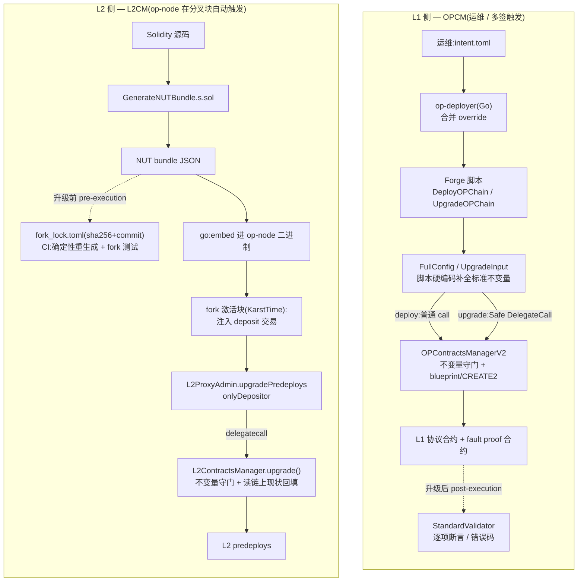

# OP Stack 合约升级架构:L1(OPCM)与 L2(L2CM)

> 本文以 OP Stack 单体仓库(optimism monorepo)为分析对象,所有代码引用均以仓库根目录为基准的相对路径给出。

## 0. 总览(为什么把 L1 与 L2 放在一起讲)

OP Stack 的链上系统分布在两个执行环境:**L1**(以太坊主网上的协议合约与 fault proof 合约)和 **L2**(链内固定地址的 predeploy 合约)。两侧都要回答同一个工程问题:

> 如何以**可管理、原子、可验证**的方式,部署并升级一整套标准化的合约?

OP 给出的答案是两个对称的"合约管理器":

- **OPCM(OP Contracts Manager)** —— 负责 L1 侧;
- **L2CM(L2 Contracts Manager)** —— 负责 L2 侧。

它们共享同一套设计哲学(按 release 钉死的单例、delegatecall 借权、原子升级、确定性寻址),但因为执行环境与治理模型不同,在**触发方式**和**验证方式**上分道扬镳。

贯穿全文的主干只有两条,其余都是为这两条服务的脚手架:

1. **不变量 / 性质(invariant / property)是什么?** —— 它们被**嵌入在 OPCM 与 L2CM 这两类合约里**,是升级正确性的最终守门人。
2. **怎么验证(verify)拿到了想要的结果?** —— L1 用**运行时链上验证器**(post-execution),L2 用**构建期确定性重生成 + CI + fork 测试**(pre-execution)。

围绕这两条主干,剩下的组件都只做两件事:**(a)生成喂给合约的内容**(L1 是 `DeployOPChainInput` / `UpgradeInputV2`,L2 是 NUT bundle);**(b)决定这些内容何时被调用**(L1 由运维 / 多签直接对 L1 合约发起调用,L2 则把内容编进 op-node、由共识层在分叉块自动注入)。

### 整体架构图

下图并排展示两侧"生成内容 → 触发执行 → 守不变量 → 验证"的完整链路。注意虚线是**验证**环节:L1 的验证在升级**之后**(运行时链上 validator),L2 的验证在升级**之前**(构建期 CI 确定性重生成)。



---

## 1. Motivation / Purpose(痛点)

### 1.1 L1 升级的痛点

在 OPCM 之前,部署或升级一条 OP Stack 链是一组零散的 Foundry 脚本加上多签手工拼装的 calldata:

- **手工配置面广、易错**:一条链涉及十几个代理合约与大量参数,手动配置制造了大量出错面;
- **难以标准化**:Superchain 的共享安全模型(共享 Security Council、共享 SuperchainConfig)要求每条链"长得一样",手工流程无法保证;
- **多签无法核对**:Security Council 多签人没法逐字节审阅几十笔 calldata;
- **缺乏原子性**:一次升级拆成几十笔交易,中间失败会让链停在危险的半升级状态。

### 1.2 L2 升级的痛点

L2 侧的历史包袱更重。在引入 L2CM(Karst 分叉)之前,每个分叉的升级交易是**手工硬编码在 op-node 的 Go 源码里**的:

```
op-node/rollup/derive/
  ├── ecotone_upgrade_transactions.go
  ├── fjord_upgrade_transactions.go
  ├── isthmus_upgrade_transactions.go
  ├── jovian_upgrade_transactions.go
  └── interop_upgrade_transactions.go
```

每个文件把目标合约的创建字节码以 `common.FromHex("0x6080...")` 常量形式粘贴进去(注释里只留一句 `Bytecode generated from commit <sha>`),再用 Go 程序化地拼出一笔笔 `DepositTx`。这带来四个结构性问题:

- **Solidity 实现 / Go 升级的割裂**:合约用 Solidity 写,却用 Go 升级,两套语言两套逻辑,难以联合测试;
- **部署 / 升级路径分叉**:创世走 Solidity 脚本,升级走 Go NUT 文件,两条路径不一致;
- **不可验证**:没有机制能证明 Go 文件里那段 bytecode 确实来自某个 commit 的 Solidity 源码,纯靠人工搬运 + review;
- **碎片化与风险规避**:不同链跑着不同版本的 L2 合约,缺乏可见性,团队因升级流程不清晰而不敢动 L2 合约。

> 一句话:L1 的痛点是"手工拼装、不可审计、不标准";L2 的痛点是"升级逻辑硬编码在 op-node、与源码脱钩、不可证明"。**两者本质相同:升级逻辑散落在易错的脚手架里,既不标准也不可验证。**

---

## 2. Scope(两侧涉及的合约与组件)

| 维度 | L1 / OPCM | L2 / L2CM |
|------|-----------|-----------|
| **管理的合约** | 协议合约:SystemConfig、OptimismPortal、ETHLockbox、L1CrossDomainMessenger、L1StandardBridge、L1ERC721Bridge、OptimismMintableERC20Factory、ProxyAdmin、AddressManager;<br>fault proof:DisputeGameFactory、AnchorStateRegistry、DelayedWETH | L2 predeploy:L1Block、GasPriceOracle、L2CrossDomainMessenger、L2StandardBridge、L2ERC721Bridge、各类 FeeVault、L2ToL1MessagePasser、interop 相关(CrossL2Inbox 等)、L2ProxyAdmin 等 |
| **核心合约** | `packages/contracts-bedrock/src/L1/opcm/OPContractsManagerV2.sol` | `packages/contracts-bedrock/src/L2/L2ContractsManager.sol` |
| **辅助合约** | Container / Migrator / Utils / StandardValidator / MigrationValidator(同目录 `packages/contracts-bedrock/src/L1/opcm/`) | `packages/contracts-bedrock/src/L2/L2ProxyAdmin.sol`、ConditionalDeployer、StorageSetter |
| **输入生成** | op-deployer(Go)+ Forge 脚本 `packages/contracts-bedrock/scripts/deploy/DeployOPChain.s.sol`、`UpgradeOPChain.s.sol` | Forge 脚本 `packages/contracts-bedrock/scripts/upgrade/GenerateNUTBundle.s.sol` → NUT bundle JSON |
| **执行触发** | 运维 / Security Council 多签(L1 交易 / Safe) | 共识客户端 op-node(分叉块自动注入) |
| **时机来源** | 运维操作 / 治理流程 | rollup config 的 fork 时间戳(如 `KarstTime`) |

> 关键认知:**L1Block 是 L2 predeploy,归 L2CM 管,不归 OPCM。** 这是一个常见的归属误区。

---

## 3. Requirements / Property(要维护的不变量)

这是主干第一条。两侧共享的核心不变量:

1. **标准化(Standardization)**:同一 release 下,每条链的合约版本、配置参数、角色权限必须对齐到统一标准;
2. **原子性(Atomicity)**:一次升级要么整体成功,要么整体回滚,不留半升级中间态;
3. **确定性(Determinism)**:部署地址用 CREATE2 提前算死、可核对;升级内容可复现;
4. **存储安全(Storage Safety)**:升级经由 delegatecall 执行,绝不能踩坏调用方(Safe / L2ProxyAdmin)的存储槽;
5. **权限正确(Authorization)**:只有合法主体能触发升级(L1 是 Proxy Admin Owner 多签,L2 是 Depositor 账户);
6. **特性门控(Feature Gating)**:某个系统特性(interop、custom gas token)只能在其对应实现已部署时才被激活。
7. **幂等 / 可重入(Idempotency)**:同一次升级 / 部署被重复执行时,不能 revert、也不能产生意外的二次状态变更 —— 重跑应收敛到同一结果。这一性质在 L2 侧尤其关键(NUT bundle 由共识层注入,必须容忍重放与跨链复用):`ConditionalDeployer` 按 `salt + codeHash` 算出确定地址,**已存在即跳过部署**(`emit ImplementationExists`)正是它的落点;L1 侧 OPCM 的 `isPermittedUpgradeSequence()` 也显式**允许重跑同一版本**,体现同一性质。

**这些不变量最终都嵌入在 OPCM 与 L2CM 合约本身**(断言、`onlyDelegatecall` 守卫、版本序列检查、feature flag 校验等),而不是在外围脚本里。这一点是理解整个架构的钥匙:脚本可以出错、可以替换,但只要合约里的不变量守得住,升级就不会把链带入非法状态。

---

## 4. Proposed Solution

按"主干 + 辅助流程"来组织:先讲不变量嵌在哪(主干),再讲谁来生成内容、内容何时被调用(辅助)。

### 4.1 主干:不变量嵌入在 OPCM / L2CM 合约中

**OPCM 侧**(`packages/contracts-bedrock/src/L1/opcm/OPContractsManagerV2.sol`):

- `_onlyDelegateCall()`:`if (address(this) == address(opcmV2)) revert` —— 保证 `upgrade()` 只能被 delegatecall,不能被直接 call;
- `_assertValidFullConfig()`:校验 7 种 dispute game 配置完整、初次部署只能启用 permissioned game、起始 game type 必须对应已启用的 game、CGT 只能在初次部署启用等;
- `isPermittedUpgradeSequence()`:只允许"重跑同版本 / 同 major 升 minor / 升下一个 major",禁止跳版本与降级;
- 按 release 钉死的单例:每个治理批准的 release(`op-contracts/vX.Y.Z`)对应一个不可变 OPCM 实例。

**L2CM 侧**(`packages/contracts-bedrock/src/L2/L2ContractsManager.sol`):

- `upgrade()` 入口同样有 `if (address(this) == THIS_L2CM) revert L2ContractsManager_OnlyDelegatecall()`;
- `isInterop && !devFeatureEnabled(OPTIMISM_PORTAL_INTEROP)` → revert:特性激活必须有对应代码已部署;
- 合约状态只允许 `immutable` / `constant`(无 storage),从根上杜绝 delegatecall 下的存储碰撞;
- `_loadFullConfig()` 不接受任何外部参数,而是**从链上现状读回配置再原样回填**,以此保证升级前后关键关系(otherMessenger、otherBridge、fee vault recipient 等)不变 —— 这是 L2CM 维护不变量的核心手段:**by construction,而非外部断言**。

#### 4.1.1 值得借鉴的设计点(Design Highlights)

OPCM 与 L2CM 在工程上有若干很漂亮的设计,它们既服务于 §3 的不变量,也是可迁移到其它"合约管理器"场景的通用模式。

**OPCM 侧**

- **版本即规范的不可变单例**:OPCM 无可变状态、不可升级,每个治理批准的 release 对应一个实例。升级"做什么"被钉死在经审计的代码里,而非依赖运行时配置 —— 把"规范"变成**可执行、可静态审计的工件**。
- **delegatecall 借权,零额外授权**:`upgrade()` 由多签 delegatecall 执行,OPCM 自身不持有任何权限;多签用本就拥有的 ProxyAdmin 权限操作自己,OPCM 只"出借逻辑"。配 `_onlyDelegateCall()` 守卫(`address(this) == opcmV2` 则 revert)防止被当普通合约误调。
- **immutable 外置到 Container**:由于 delegatecall 上下文下 `immutable` 会读到错值,blueprint / 实现地址被挪到独立的 `OPContractsManagerContainer` 合约,用普通 call 读取 —— 对 delegatecall 陷阱的精准规避。
- **ExtraInstruction 白名单逃生口**:新版本要加参数时,不改 OPCM 的 ABI / struct,而是通过经白名单校验的 `{key, data}` 指令传入,在"接口稳定"与"可扩展"之间取得平衡。
- **模块化绕开 EIP-170**:Container / Migrator / Utils / UtilsCaller / Validator 拆分,`UtilsCaller` 用 delegatecall / staticcall 包装把逻辑分散到多合约,既绕开 24KB 字节码上限,又保持单一存储上下文。

**L2CM 侧**

- **ConditionalDeployer 的幂等部署**(`packages/contracts-bedrock/src/L2/ConditionalDeployer.sol`):借助 Arachnid 通用 CREATE2 工厂(`0x4e59…`),先用 `salt + codeHash` 算出确定地址,**若该地址已有代码则直接跳过**(`emit ImplementationExists` 并返回),否则才部署,并校验"实际部署地址 == 预期地址",不符即 revert。这一个小合约同时拿下三个性质:
  1. **幂等 / 可重入**:同一实现已部署时不会 revert,bundle 可安全重跑;
  2. **抗碰撞 + 跨链复用**:确定性地址让相同字节码在任意链上落到同一地址;
  3. **可预计算**:bundle 生成器无需 RPC 即可算出所有实现地址 —— 这正是 §6 中"字节级可复现验证"的前提。

  > **幂等归属:生成期 vs 执行期(易误读)**。容易以为是生成器 `GenerateNUTBundle.s.sol` 在挑"哪些要重部署"——并非如此,方向恰好相反。生成器只认一份**静态全量清单**(`UpgradeUtils.getImplementationsNamesToUpgrade()`,`pure` 函数,实现名写死),在 `_generateImplementationDeployments` 里对清单中**每一个**实现**无条件**生成一笔 `ConditionalDeployer.deploy(salt, code)` 部署 NUT(编码见 `UpgradeUtils.createDeploymentTxnWithArgs`,`packages/contracts-bedrock/scripts/libraries/UpgradeUtils.sol:229`)。它在**构建期**运行、无 RPC、看不到链上现状,因此**不做任何"已部署就跳过"的过滤,从不跳过**。真正的跳过发生在**链上、执行期**:每笔 NUT 都打到 `CONDITIONAL_DEPLOYER`,由 `deploy` 用 `CREATE2(salt, bytecode)` 算地址、判 `code.length != 0` 决定是否部署。故分工是:**生成器决定"要算哪些地址"(salt + 字节码 → 静态全量清单),ConditionalDeployer 在链上决定"这个地址要不要真部署"**。这些部署 NUT 与末笔的 `L2ProxyAdmin.upgradePredeploys(l2cm)`(见 §4.3 / §5.2)是同一 bundle 里的**兄弟交易**,而非 L2CM 去调用 `deploy`。
- **无参 + 读链上现状回填**:`upgrade()` 无参数,从既有 predeploy 与 L1Block `gather` 配置,by construction 保住配置连续性。
- **仅 immutable / constant 状态**:从根上杜绝 delegatecall 下的存储碰撞(对应 FMA 的 FM2)。
- **单次 delegatecall 原子升级**:整套 predeploy 升级在一个 delegatecall 内完成,全成或全败。
- **与 OPCM 对称的 StorageSetter re-init 原语**:先把代理指向 StorageSetter 重置 Initializable 槽(兼容 OZ v4 / v5),再指向真实现并 `initialize` —— 两侧复用同一套升级原语,是很克制的设计。

> 一条横向观察:**两侧都把"升级"抽象成同一组原语**(`onlyDelegatecall` 守卫 + StorageSetter re-init + 确定性 CREATE2 部署),只是在 L1 / L2 不同执行环境里换了触发与验证外壳。这种对称性本身就是降低心智负担、便于联合审计的设计。

#### 4.1.2 心智模型:OPCM 引擎 × superchain-ops 模板 × TOML 配置(三轴三层)

OPCM 是"每 release 一个的引擎",但生产环境里多签并不直接手写 calldata,而是经由 **superchain-ops** 仓库的任务模板(如 `OPCMUpgradeV700.sol`、`AddGameTypeTemplate.sol`,均继承 `OPCMTaskBase`)执行。一个常见疑问是:"既然只有一个 OPCM,为什么要这么多模板,换 input 不就行了?" 答案是三个正交的轴逼出了模板的细分:

- **轴一 · 操作类型**:OPCM 暴露的不止 `upgrade()`。`OPCMUpgradeV*` 调 `upgrade()` / `upgradeSuperchain()`;`AddGameTypeTemplate` 调 `addGameType()`,只动 DisputeGameFactory。换 input 换不出"换函数"。
- **轴二 · 版本 ABI 钉死**:OPCM 每 release 一个新合约,`upgrade` 的 struct / ABI 跨版本会变(`IOPContractsManagerV700` vs `V800` vs `U18`)。Solidity 静态类型决定了 v8 的 struct 喂不进 v7 的签名,模板必须按版本固定接口。
- **轴三 · 安全包络(最关键)**:每个模板不仅构造 calldata,还声明**这次操作允许产生的状态变化边界**,供多签与模拟工具静态核对:`_setAllowedStorageAccesses` / `_taskStorageWrites`(只准动哪些合约的存储,如 AddGameType 只准动 DisputeGameFactoryProxy)、`_getCodeExceptions`、`_validate`(操作后逐项断言;升级类会跑 `StandardValidator` 并比对 `expectedValidationErrors`)。

由此得到清晰的三层心智模型:

```
OPCM(每 release 一个)            = 引擎:真正干活 + 守不变量
   ▲ delegatecall(经 Multicall3DelegateCall 在 Safe 上下文)
Template(每 操作类型 × 版本)     = 多签面向的任务定义:
   - 选对 entrypoint(轴一)/ 钉死版本 ABI(轴二)
   - 声明允许的 state-change 包络 + 跑验证(轴三)
   ▲ 填入
TOML 配置(每次执行)             = 这一次:哪些链、哪个 prestate、哪些 bond
```

**结论**:模板对"链"和"操作实例"是通用的(换 TOML 即可复用),但对"操作类型 × OPCM 版本"是专属的(必须新写模板)。这套细分把"可审计性"做成了类型系统 —— 每个模板是一个经过 review、边界固定的**任务类型**;若退化成"一个万能模板 + 任意 input",签名者就只能盲信 input、无法静态判断爆炸半径(blast radius),反而退回 OPCM 想消灭的痛点。

### 4.2 辅助:谁来生成喂给合约的内容

合约只负责执行与守不变量,具体"这次升级要做什么"由外围脚本生成:

- **L1**:op-deployer(Go)读取运维的声明式 `intent.toml`,合并 override 后产出 `DeployOPChainInput` / `UpgradeInputV2`,再调起 Forge 脚本。脚本(`DeployOPChain.s.sol` 的 `_toOPCMV2DeployInput()`)把**标准不变量**(标准 dispute 参数、`DEFAULT_RESOURCE_CONFIG`、7 种 game 的固定顺序、默认 anchor root)**硬编码补全**成完整的 `FullConfig`。运维改不动这些标准值 —— 这正是"标准化"在工程上的落地点。
- **L2**:Forge 脚本 `GenerateNUTBundle.s.sol` 按固定四阶段(pre-impl → impl deploy → pre-L2CM → L2CM deploy)读取编译后的字节码,生成一份 **NUT bundle JSON**,产物先落到 `packages/contracts-bedrock/snapshots/upgrades/current-upgrade-bundle.json`,再快照进 `op-core/nuts/bundles/<fork>_nut_bundle.json` 并在 `op-core/nuts/fork_lock.toml` 记录 sha256 与源 commit。**注意:bundle 由脚本生成,不是 L2CM 生成;L2CM 只是 bundle 里被部署、被调用的那个合约。**

### 4.3 辅助:生成的内容何时、如何被调用

这是 L1 与 L2 最大的分水岭:

- **L1 —— 直接对 L1 合约发起调用**:
  - `deploy`:Forge 脚本通过 `vm.broadcast` 直接 `opcmV2.deploy(config)`(普通 call);
  - `upgrade`:由于 `upgrade()` 强制 delegatecall,脚本用 `packages/contracts-bedrock/scripts/libraries/DummyCaller.sol` 把一个 fallback-delegatecall 合约 `vm.etch` 到 prank 地址来**模拟**多签;**生产环境**则由 Security Council 多签 / Safe 以 `Operation.DelegateCall` 提交那段 `upgrade(UpgradeInput)` calldata。
  - `extraInstructions` 是"不改 OPCM ABI 就能塞入新参数"的**白名单逃生口**,经 `_assertValidUpgradeInstructions()` 校验后生效。

- **L2 —— 写进 op-node、由共识层注入**:
  - 生成好的 bundle 通过 `//go:embed`(见 `op-core/nuts/bundles.go`)编进 op-node 二进制;
  - 到达 fork 时间戳的激活块时,op-node 把 bundle 各笔作为 deposit 交易注入区块,**末笔**调用 `L2ProxyAdmin.upgradePredeploys(l2cm)`(校验 `msg.sender == DEPOSITOR_ACCOUNT`),后者 `delegatecall` 进 `L2CM.upgrade()`,由 L2CM 在一次 delegatecall 内完成所有 predeploy 升级 —— 这就是 L2 的原子升级。
  - 全程没有运维可喂的配置参数,这正是 `L2CM.upgrade()` 无参数的原因。

### 4.4 Key Components 一览

| 角色 | L1 | L2 |
|------|----|----|
| 不变量守门合约 | `OPContractsManagerV2` | `L2ContractsManager` |
| 验证器 | `OPContractsManagerStandardValidator` / `MigrationValidator` | (无运行时验证器,见 §6) |
| 输入生成 | op-deployer + `DeployOPChain.s.sol` / `UpgradeOPChain.s.sol` | `GenerateNUTBundle.s.sol` |
| 升级执行入口 | Safe(DelegateCall)→ OPCM | `L2ProxyAdmin.upgradePredeploys` → L2CM |
| 部署器 | Blueprint(ERC-5202)+ CREATE2 | ConditionalDeployer + CREATE2 |
| 触发者 | 运维 / 多签 | op-node(Depositor 账户) |
| 内容载体 | 链下编码的 struct calldata | git 跟踪、二进制内嵌的 NUT bundle JSON |

---

## 5. 主要流程

### 5.1 L1 部署 / 升级流程

```
运维写 intent.toml
   │ op-deployer(Go):合并 override
   ▼
产出 DeployOPChainInput / UpgradeInputV2 → 调起 Forge 脚本
   │
   ├─ deploy:脚本把标准不变量硬编码补全成 FullConfig
   │         → vm.broadcast → opcmV2.deploy(config)        [普通 call]
   │
   └─ upgrade:把精简的 UpgradeInput 编码
             → DummyCaller 模拟 delegatecall(生产由 Safe 以 DelegateCall 提交)
             → opcmV2.upgrade(UpgradeInput)                [delegatecall]
```

要点:`deploy` 用 blueprint + CREATE2 部署全套代理并把所有权移交 Proxy Admin Owner;`upgrade` 不重述整条链,OPCM 自己从传入的 `systemConfig` 反查所有现有合约。

### 5.2 L2 升级流程

```
① 生成(构建期)
   改 Solidity → just generate-nut-bundle
   → GenerateNUTBundle.s.sol 读编译字节码 → current-upgrade-bundle.json

② 快照 + 锁定(发布期)
   just nut-snapshot-for <fork>
   → op-core/nuts/bundles/<fork>_nut_bundle.json + fork_lock.toml(sha256 + commit)
   → CI(check-nut-locks)校验

③ 执行(链上,fork 激活块)
   op-node go:embed bundle → 到 fork 时间戳注入为 deposit 交易:
     L1 Info → 部署 ConditionalDeployer → 部署各实现
     → 部署 L2CM → L2ProxyAdmin.upgradePredeploys(l2cm)
                      → delegatecall → L2CM.upgrade()
                          → 逐个 predeploy upgradeTo + re-init
```

要点:升级块的 gas 额度从早期的约 1M 提升到约 50M 以容纳多合约升级;所有 NUT 交易由 Depositor 账户(`0xDeaDDEaDDeAdDeAdDEAdDEaddeAddEAdDEAd0001`)发出,排在用户交易之前;L2CM 的配置全部 `gather` 自链上现状。

---

## 6. 如何保持 invariant 与如何 verify(主干第二条)

不变量靠 §4.1 的合约内置守卫维持。**验证**则两侧形态不同,这是本文最值得强调的对比:

| | L1 / OPCM | L2 / L2CM |
|---|-----------|-----------|
| **验证形态** | **运行时、链上 post-execution 验证器** | **构建 / 发布期 pre-execution 验证** |
| **机制** | `StandardValidator` / `MigrationValidator`:升级后调用,逐项断言(版本、proxy admin owner、SystemConfig 参数、dispute game 参数、角色等),把所有错误**累加成逗号分隔的错误码串**(如 `SYSCON-20,DF-50,PDDG-100`),由 `_allowFailure` 决定是 revert 还是返回字符串 | ① **确定性重生成**:在记录的 commit 重新跑生成脚本,字节级比对 bundle(`just nut-provenance-verify`);② CI `check-nut-locks` 校验 sha256 与 lock 一致;③ **fork 差分测试**:把 bundle 跑在真实链快照上验证状态转移;④ 跨客户端一致性 |
| **为何如此** | L1 升级有多签介入:可以"多签先批准 → validator 再独立复核",运行时验证天然可行 | L2 升级由共识层自动执行、无多签介入,无法在链上事后人工复核;只能把验证前移到"可证明 bundle 来自源码" + 测试 |
| **不变量延续** | 外部 validator 断言达标 | "读旧值原样回填" + 单次 delegatecall 原子性 + 仅 immutable/constant 防存储碰撞 |

> 结论:**OPCM 用"运行时验证器"在升级后核验;L2CM 用"确定性可重生成 + CI + fork 测试"在升级前保证。** L2CM 这侧没有 L1 那种独立的 post-execution 链上验证合约 —— 这是由两侧治理模型(有无多签介入)决定的,而非疏漏。

---

## 7. 总结(总)

OP Stack 把"如何可管理、原子、可验证地部署与升级一整套标准化合约"这一问题,在 L1 与 L2 两个执行环境里用一对对称的合约管理器解决:

- **OPCM** 解决 **L1 协议合约 + fault proof 合约**的初次部署与升级。它用 blueprint + CREATE2 确定性寻址、按 release 钉死的单例、多签 delegatecall 借权,使部署升级**可管理、可标准化**;不变量嵌在合约的断言与版本序列检查中,并由**运行时 StandardValidator** 做 post-execution 验证。输入由 op-deployer 从声明式 `intent.toml` 生成,直接对 L1 合约发起调用。

- **L2CM** 解决 **L2 predeploy** 的升级。它把过去硬编码在 op-node Go 文件里的升级逻辑**收敛进一个链上合约**,使共识层注入的 NUT bundle 大幅简化、并实现**单次 delegatecall 原子升级**;不变量靠"读旧值回填 + 仅 immutable 状态 + feature 门控"by construction 维持;正确性靠**确定性 bundle 重生成 + CI 哈希锁 + fork / 跨客户端测试**在升级前保证。bundle 由 Forge 脚本生成、写入 op-node,由 op-node 在分叉块经 `L2ProxyAdmin` delegatecall 触发 L2CM 执行。

两条主干贯穿始终:**不变量嵌在 OPCM / L2CM 合约里,验证则按治理模型分别落在"运行时链上"(L1)与"构建期可复现"(L2)。** 其余所有组件——op-deployer、Forge 脚本、NUT bundle、op-node——都只是围绕这两条主干、负责"生成内容"与"决定何时调用"的脚手架。

---

## References

- OP Contracts Manager(OPCM)Spec — https://specs.optimism.io/experimental/op-contracts-manager.html
- Design Doc: L2 Contract Upgrades — https://github.com/ethereum-optimism/design-docs/blob/main/protocol/l2-contract-upgrades.md
- Spec: L2 Upgrades — Execution — https://github.com/ethereum-optimism/specs/blob/main/specs/protocol/l2-upgrades-1-execution.md
- FMA: L2 Contracts Manager(失效模式分析)— https://github.com/ethereum-optimism/design-docs/blob/main/security/fma-l2cm.md
- superchain-ops(L1 生产执行 / 治理任务仓库)— https://github.com/ethereum-optimism/superchain-ops
- 任务模板示例 `OPCMUpgradeV700.sol` — https://github.com/ethereum-optimism/superchain-ops/blob/main/src/template/OPCMUpgradeV700.sol
- 任务模板示例 `AddGameTypeTemplate.sol` — https://github.com/ethereum-optimism/superchain-ops/blob/main/src/template/AddGameTypeTemplate.sol
- ERC-5202: Blueprint contract format(OPCM blueprint 部署所依据)— https://eips.ethereum.org/EIPS/eip-5202
